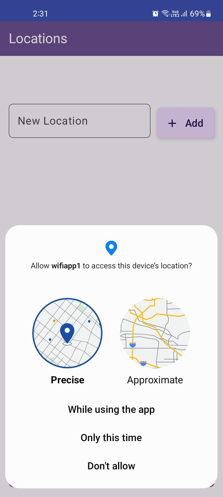
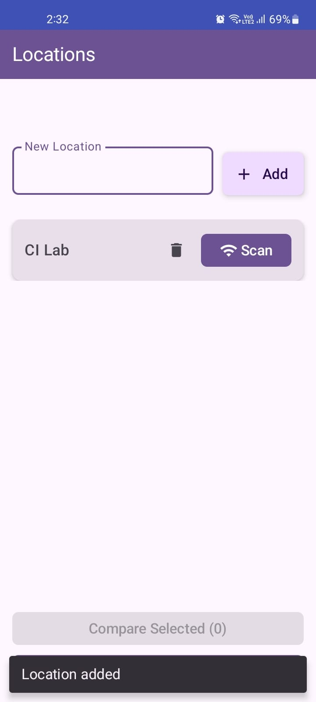
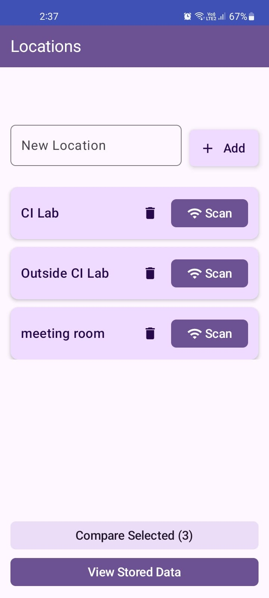
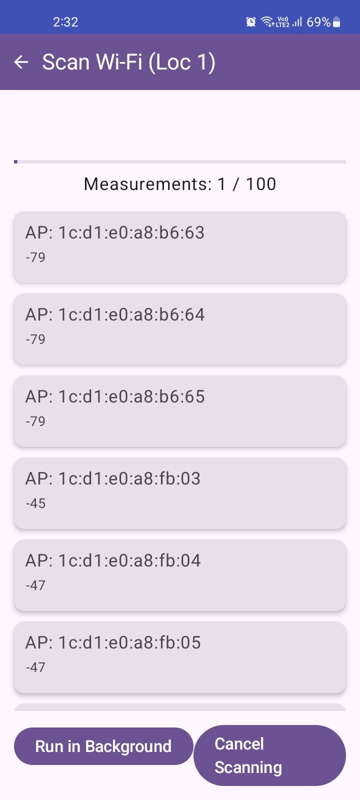
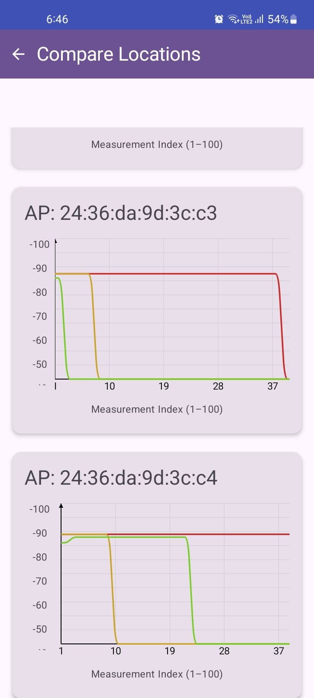

# 📶 Wi-Fi Logger App

A Jetpack Compose-based Android app that measures and records Wi-Fi signal strength (RSSI) at user-defined locations. Compare signal stability and strength across areas like your room, office, or lab — perfect for indoor wireless analysis or positioning research.

---

## 🚀 Features

- 📍 Add at least three custom-named locations (e.g. "Room A", "Hallway", "Kitchen").
- 📡 Run 100-sample RSSI scans per location to record signal strengths of visible Wi-Fi access points.
- 💾 Save results to local Room Database with per-AP RSSI matrices.
- 🔄 Live & stored data views with real-time 10×10 grid updates.
- 📊 Compare RSSI data across locations using:
  - Line charts of RSSI vs. time for common APs.
  - Bar charts showing max signal strength per location.
  - Highlights for the best-performing location per AP.

---

## 🧠 How It Works

- Built with Jetpack Compose, Kotlin Coroutines, and Room DB.
- Uses Android’s WifiManager API to scan Wi-Fi APs in ~3 second intervals.
- Maintains a 100-point rolling RSSI matrix per AP per location.
- StateFlows are used for live scan updates.
- UI shows data in matrices, charts, and info cards.

---

## 🗃️ Data Model (Room DB)

- 📌 Location: { id, name }
- 📈 Scan: { id, locationId, ssid, bssid, timestamp, rssiMatrix }

---

## 📲 App Screens

| Permission Screen | Home Screen | Multiple Location Added Screen | Scan Screen | Stored & Live Data Screen | Comparison Screen |
|-------------------|-------------|--------------------------------||------------||--------------------------||------------------|
|  |  |  |  |  | 

---

## 🧪 Getting Started

1. Clone the repository into Android Studio.
2. Sync Gradle files.
3. Install and run on a real Android device (requires Wi-Fi and location permission).
4. On first launch:
   - Add three locations.
   - Tap "Scan" for each and wait for 100 samples.
5. Navigate through:
   - Live Grid View (10×10 matrix per AP)
   - Stored Snapshots
   - Compare RSSI across locations

``OR``
Install the APK from the Repo.
---

## 🔐 Permissions

Make sure the following permissions are granted:

- ACCESS_FINE_LOCATION or ACCESS_COARSE_LOCATION
- ACCESS_WIFI_STATE
- CHANGE_WIFI_STATE (Optional for API < 29)

> Note: Starting from Android 10+, location access is required to retrieve Wi-Fi scan results.

---

## 📉 Data Comparison

The app computes:

- Average, Min, Max RSSI for each AP
- Visual curve of signal stability per location
- "Best signal" location highlights

---

## 📦 Tech Stack

- Kotlin + Jetpack Compose
- Room Database
- StateFlow & Coroutines
- MPAndroidChart for graphs
- Android WifiManager

---

## 📜 License

This project is for academic and educational purposes. You may modify and extend it under standard open-source guidelines.

---
